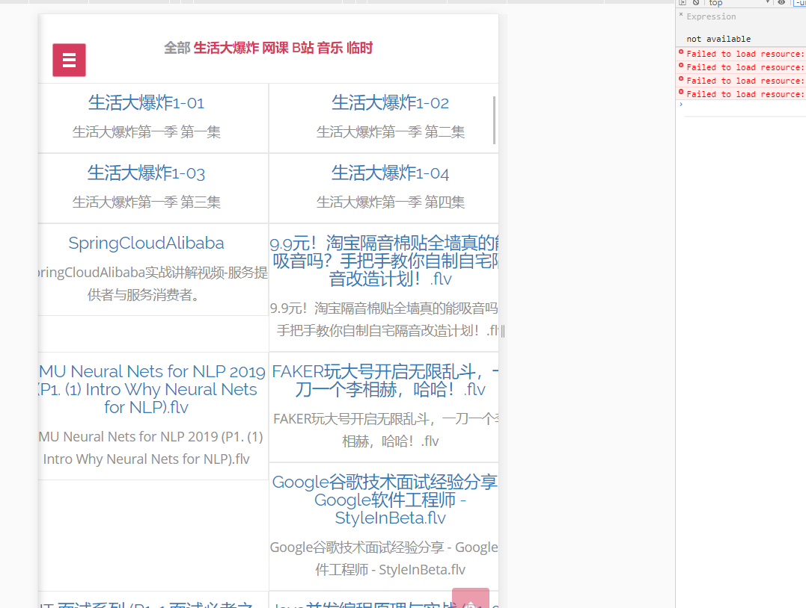

## 如何打造一款局域网内视频服务集群

最近在补生活大爆炸，从网盘上下载了全季的视频，每天晚上都会在电脑上看几集再去睡觉。因为视频资源太过庞大，所以我想在手机上看，就需要每次把视频传到手机，看完之后删掉再传新的，如果是看网上的资源，网速的问题可能会长时间需要加载。所以我准备给我的电脑搭建一个服务，可以在同一局域网下让我的手机平板等都可以访问我电脑的资源，这样就不用担心网速问题了，差不多类似于一个局域网的在线影院。

我可以把最后的应用包安装到一台根本不需要任何性能的服务器，只需要它有大量的硬盘空间，类似于淘宝上的玩客云(硬盘还得自己提供，这就能卖200多？)。

最简单的服务器你可以直接用你报废的手机，不要拿去换不锈钢盆，稍微改装一下就可以变成一个Linux服务器，为你局域网下其他设备来提供服务(怎么做之后出教程)。

虽然说只是一个简单的云影院，但是我还是准备用上一些高大上的框架，一边学习一边完善，杀鸡就要用屠龙宝刀。

大概说一下技术选型。

Spring Boot (应用主体)

Spring Cloud Alibaba (服务发现,负载均衡,容错等,激活会用上所有SpringCouldAlibaba的微服务框架，因为最近正在学这个)

MyBatis (数据)

Elasticsearch (搜索，正在学这个)


#### 构建项目

项目环境分为Dev和Proc，分别是开发环境和线上环境，线上环境会限制连接。

```yaml
spring:
  profiles: dev
---
spring:
  profiles: proc
server:
  tomcat:
    max-connections: 1000
    max-threads: 200
    max-http-post-size: 2MB
```

服务发现组件使用Nacos，局域网内每一个服务启动时会注册在Nacos中，Nacos是SpringCloudAlibaba提供的微服务组件，本项目中配置在yum配置中。

无需任何配置，`startup.cmd -m standalone`即可启动。


访问`localhost:8848/nacos`， 用户名密码均为nacos，即可在服务列表中查看已启动的本项目组件。

数据库使用本地数据库。

```yaml
spring:
  datasource:
    url: jdbc:mysql://localhost:3306/user_center?serverTimezone=GMT
    hikari:
      username: root
      password: root
      driver-class-name: com.mysql.cj.jdbc.Driver
```

#### 资源访问路径

静态样式资源以及视频等路径配置在WebMvcConfig中，addResourceLocations根据自己磁盘中文件路径配置。

```java
@Configuration
public class WebMvcConfig implements WebMvcConfigurer {
    public void  addResourceHandlers(ResourceHandlerRegistry registry){
        registry.addResourceHandler("/**").addResourceLocations("file:G:/bilibili/");
        WebMvcConfigurer.super.addResourceHandlers(registry);
    }
}
```

#### 数据库表


数据实例，localUrl是相对你在上一步Config中指定路径下的。


type字段决定了视频类型，在前端会有相应的分组。


在Test中有针对相应文件夹的批量导入方法，可以自行修改来导入本地视频。

#### 前端

前端的视频播放插件选用DPlayer。

```html
<link rel="stylesheet" href="DPlayer.min.css" />
<div id="dplayer"></div>
<script src="DPlayer.min.js"></script>
<script>
const dp = new DPlayer({
    container: document.getElementById('dplayer'),
    video: {
        url: 'demo.mp4',
    },
});
</script>
```

上述是mp4的通用播放方法，对于flv，需要指定video-type对flv，并导入flv.js进行解析。

#### 健康检查

```xml
<dependency>
    <groupId>org.springframework.boot</groupId>
    <artifactId>spring-boot-starter-actuator</artifactId>
</dependency>
```

使用actuator进行健康检查。


#### 使用

针对自己的情况完成了上述配置，就可以在局域网内正式使用该服务了。

启动项目，发现一台服务。


然后访问服务的地址，在yum中我们选择了8081端口。

因为该服务主要面向移动端，所以这里演示为手机效果。


继续下拉，就可以到视频列表了。




mv_db中的mv_type决定了分类。


选择视频后即可跳转到相应播放界面，在局域网内体验高速服务，不用担心流量以及限速问题。

可以配合bilibili-spider批量将B站收藏夹视频文件下载到本地，在Test中导入。

